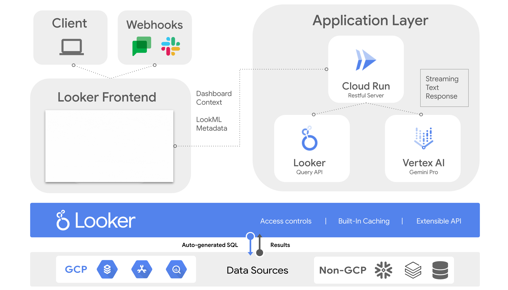

# Looker Dashboard Summarization

This is an extension or plugin for Looker that integrates LLM's hosted on Vertex AI into a streaming dashboard summarization experience powered by Websockets.


## Description

The Dashboard Summarization extension can be broken down into 3 parts:

 1. **Summarization**
	 - Generates concise summaries on your dashboard's data
 2. **Prescription**
	 - Grounded in your dashboard's data, it can prescribe operational actions and point out outliers
 3. **Action**
	 - Leveraging Looker's API, insights can be exported into the business tools your organization uses

Additionally, the extension provides:

 - Google Chat Export (*Oauth integration to export the summary to Google Chat*)
 - Slack Export (*Oauth integration to export the summary to Slack in rich text*)
 - Custom Summary Prompts (Ability to provide specific guidance for summary generation)
 - Summary Regeneration (Regenerate summaries with different styles or focuses)
 - Queries run with user context


### Technologies Used
#### Frontend
- [React](https://reactjs.org/)
- [TypeScript](https://www.typescriptlang.org/)
- [Webpack](https://webpack.js.org/)

#### Looker
- [Looker Extension SDK](https://github.com/looker-open-source/sdk-codegen/tree/main/packages/extension-sdk-react)
- [Looker Query API](https://developers.looker.com/api/explorer/4.0/methods/Query)

#### Backend API
- [Google Cloud Platform](https://cloud.google.com/)
- [Vertex AI](https://cloud.google.com/vertex-ai)
- [Cloud Run](https://cloud.google.com/run?hl=en)

#### Export API's
- [Slack](https://api.slack.com/authentication/oauth-v2)
- [GChat](https://developers.google.com/chat/api/guides/auth/users)
- ---

## Setup



### 1. REST API Server

This section describes how to set up the API server on Cloud Run powering the Generative AI integrations.

#### Getting Started for Local Development

1. Clone or download a copy of this repository to your development machine.

   ```bash
   # cd ~/ Optional. your user directory is usually a good place to git clone to.
   git clone https://github.com/looker-open-source/dashboard-summarization.git
   ```

2. Navigate (`cd`) to the template directory on your system

   ```bash
   cd dashboard-summarization/restful-service/src
   ```

3. Install the dependencies with [NPM](https://docs.npmjs.com/downloading-and-installing-node-js-and-npm).

   ```bash
   npm install
   ```

   > You may need to update your Node version or use a [Node version manager](https://github.com/nvm-sh/nvm) to change your Node version.

4. Authenticate to Google Cloud

```bash
gcloud auth login && gcloud auth application-default login
gcloud config set project <project>
```

5. Start the development server

   ```bash
   npm run start
   ```
	Your development server should be running at http://localhost:5000


#### Deployment

1. For deployment you will need to build the docker file and submit it to the [Artifact Registry](https://cloud.google.com/artifact-registry). You need to first create a repository. Update `location` to your deployment region, then run this command from root
	```bash
	gcloud artifacts repositories create dashboard-summarization-docker-repo  --repository-format=docker  --location=REGION
	```

2. Navigate to template directory
	```bash
	cd dashboard-summarization/restful-service/src
	```

3. Update cloudbuild.yaml
	```
	<YOUR_REGION> = Your deployment region
   <YOUR_PROJECT_ID> = Your GCP project ID
	```

4. Build Docker File and Submit to Artifact Registry, replacing the `REGION` variable with your deployment region.
*Skip this step if you already have a deployed image.* Please see the [official docs](https://cloud.google.com/build/docs/configuring-builds/create-basic-configuration) for creating the yaml file.
	```bash
	gcloud auth login && gcloud auth application-default login && gcloud builds submit --region=REGION --config cloudbuild.yaml
	```
	Save the returned docker image url. You can also get the docker image url from the Artifact Registry

5. Navigate (`cd`) to the terraform directory on your system
	```bash
	cd .. && cd terraform
	```
6. Replace defaults in the `variables.tf` file for project, region, docker url and service name.
	```
	project_id=<GCP project ID>
   deployment_region=<Your deployement region>
   docker_image=<The docker image url from step 5>
   genai_client_secret_value=<secret used to secure endpoints for public service>
	```

7. Deploy resources. [*Ensure Application Default Credentials for GCP for Exported in your Environment first.*](https://cloud.google.com/docs/authentication/provide-credentials-adc#google-idp)

   ```terraform
   terraform init

   terraform plan

   terraform apply
   ```

8. Save Deployed Cloud Run URL Endpoint

#### Optional: Setup Log Sink to BQ for LLM Cost Estimation and Request Logging

This extension will make a call to Vertex for each query in the dashboard and one final call to format all the summaries. Each request is logged with billable characters that can be used to 
estimate and monitor costs. Please see [Google Cloud's docs](https://cloud.google.com/logging/docs/export/configure_export_v2#creating_sink) on setting up a log sink to BQ, using the below filter for Dashboard Summarization Logs (*change location and service name if those variables have been updated*):

```
resource.type = "cloud_run_revision"
resource.labels.service_name = "dashboard-summarization-service"
resource.labels.location = "us-central1"
 severity>=DEFAULT
jsonPayload.component="dashboard-summarization-logs"
```


### 2. Looker Extension Framework Setup


#### Getting Started for Local Development

1. Clone or download a copy of this repository to your development machine (if you haven't already).

   ```bash
   # cd ~/ Optional. your user directory is usually a good place to git clone to.
   git clone https://github.com/looker-open-source/dashboard-summarization.git
   ```

2. Navigate (`cd`) to the root directory in the cloned repo

3. Ensure All the Appropriate Environment Variables are set. Copy .env.example file and save as .env
*See Export Integration Steps below for Slack and Gchat Variables. These are optional, except RESTFUL_SERVICE & GENAI_CLIENT_SECRET*. To Note, the GenAI Client Secret will be used as an environment variable only in development. When you deploy the extension to production, you'll need to save it as a user attribute in Looker with a specific format. This is so that the secret is secured and not evaluated client side. More instructions on this in the `Deployment` instructions further down.
```
SLACK_CLIENT_ID=
SLACK_CLIENT_SECRET=
CHANNEL_ID=
SPACE_ID=
RESTFUL_SERVICE=<Required: Cloud run endpoint url>
GENAI_CLIENT_SECRET=<same secret value used to secure Cloud Run service>
```

4. Install the dependencies with [NPM](https://docs.npmjs.com/downloading-and-installing-node-js-and-npm).

   ```bash
   npm install
   ```

   > You may need to update your Node version or use a [Node version manager](https://github.com/nvm-sh/nvm) to change your Node version.
   > If you get errors installing dependencies, you may try
   ```bash
   npm install --legacy-peer-deps
   ```

5. Start the development server

   ```bash
   npm run develop
   ```

   Great! Your extension is now running and serving the JavaScript at https://localhost:3000/dashboard_summarization.js.

6. Now log in to Looker and create a new project.

   This is found under **Develop** => **Manage LookML Projects** => **New LookML Project**.

   You'll want to select "Blank Project" as your "Starting Point". You'll now have a new project with no files.

   1. In your copy of the extension project you have a `manifest.lkml` file.

   You can either drag & upload this file into your Looker project, or create a `manifest.lkml` with the same content. Change the `id`, `label`, or `url` as needed.

  

      project_name: "dashboard-summarization-extension"
        
        application: dashboard-summarization {
          label: "Dashboard Insights Powered by Vertex AI"
          # file: "dashboard_summarization.js"
          url: "https://localhost:3000/dashboard_summarization.js"
          mount_points: {
            dashboard_vis: yes
            dashboard_tile: yes
            standalone: yes
          }
          entitlements: {
            local_storage: yes
            use_form_submit: yes
            core_api_methods: ["run_inline_query","run_query","all_lookml_models","dashboard","dashboard_dashboard_elements"]
            external_api_urls: [
           "YOUR CLOUD RUN URL","http://localhost:5000","http://localhost:3000","https://*.googleapis.com","https://slack.com/api/*","https://slack.com/*"
          ]
            oauth2_urls: [
              "https://accounts.google.com/o/oauth2/v2/auth",
              "https://www.googleapis.com/auth/chat.spaces",
              "https://www.googleapis.com/auth/drive.metadata.readonly",
              "https://www.googleapis.com/auth/spreadsheets.readonly",
              "https://www.googleapis.com/auth/userinfo.profile",
              "https://www.googleapis.com/auth/chat.spaces.readonly",
              "https://www.googleapis.com/auth/chat.bot",
              "https://www.googleapis.com/auth/chat.messages",
              "https://www.googleapis.com/auth/chat.messages.create",
              "https://slack.com/oauth/v2/authorize"
            ]
            scoped_user_attributes:["genai_client_secret"]
          }
        }

7. Create a `model` LookML file in your project. The name doesn't matter. The model and connection won't be used, and in the future this step may be eliminated.

   - Add a connection in this model. It can be any connection, it doesn't matter which.
   - [Configure the model you created](https://docs.looker.com/data-modeling/getting-started/create-projects#configuring_a_model) so that it has access to some connection.

8. Connect your new project to Git. You can do this multiple ways:

   - Create a new repository on GitHub or a similar service, and follow the instructions to [connect your project to Git](https://docs.looker.com/data-modeling/getting-started/setting-up-git-connection)
   - A simpler but less powerful approach is to set up git with the "Bare" repository option which does not require connecting to an external Git Service.

9. Commit your changes and deploy your them to production through the Project UI.

10. Reload the page and click the `Browse` dropdown menu. You should see your extension in the list.
   - The extension will load the JavaScript from the `url` provided in the `application` definition. By default, this is https://localhost:3000/dashboard_summarization.js. If you change the port your server runs on in the package.json, you will need to also update it in the manifest.lkml.

- Refreshing the extension page will bring in any new code changes from the extension template, although some changes will hot reload.


#### Deployment

The process above requires your local development server to be running to load the extension code. To allow other people to use the extension, a production build of the extension needs to be run. As the kitchensink uses code splitting to reduce the size of the initially loaded bundle, multiple JavaScript files are generated.

1. In your extension project directory on your development machine, build the extension by running the command `npm run build`.
2. Drag and drop the generated JavaScript file(bundle.js) contained in the `dist` directory into the Looker project interface.
3. Modify your `manifest.lkml` to use `file` instead of `url` and point it at the `dashboard_summarization.js` file.
4. [IMPORTANT] Create a User Attribute in Looker following this naming convention `<extension_id>_genai_client_secret`. Note any dash or :: in the extension_id name will need to be replaced with an underscore. Typically the extension id will be your lookml project name where the extension lives followed by the name of the extension ie. `dashboard-summarization`. See [the docs](https://cloud.google.com/looker/docs/extension-framework-react-and-js-code-examples#user_attributes) for more details

Note that the additional JavaScript files generated during the production build process do not have to be mentioned in the manifest. These files will be loaded dynamically by the extension as and when they are needed. Note that to utilize code splitting, the Looker server must be at version 7.21 or above.

### 3. [Optional] Export Integration Setup

 #### Slack OAuth Setup 
 1. Follow the official Slack developer docs to setup an [OAuth Application](https://api.slack.com/authentication/oauth-v2)
 2. Acquire a `SLACK_CLIENT_ID`  and `SLACK_CLIENT_SECRET` from the OAuth app created in Step 1 and add them to the `.env` file.
 3. Attach the appropriate [User & Bot Scopes](https://api.slack.com/scopes) (recommended to at least have `channels:read` and `channels:write`)
 4. [Optional] if making Bot requests, add the bot to channels you want it accessing.

> To note, the Slack integration hardcodes a specific channel id in the code. These can be modified or an additional API request made to provide a channel selector experience.

#### Google Chat OAuth Setup
1. Follow the official Google Chat developer docs to setup an [OAuth Application](https://developers.google.com/chat/api/guides/auth)
2. Acquire a `GOOGLE_CLIENT_ID` from the OAuth app created in Step 1 and add them to the `.env` file.
3. Configure a [Google Chat Bot](https://developers.google.com/chat/quickstart/gcf-app) to send messages (*this bot is only used for message ownership and not used to call the Google Chat API*)
4. Add bot to specific Google Chat Spaces.

> To note, the Google Chat Integration hardcodes a specific space id in the code. These can be modified or an additional API request made to provide a space selector experience.

---

### Recommendations for fine tuning the model

This app uses a one shot prompt technique for fine tuning the LLM, meaning that all the metadata for the dashboard and request is contained in the prompt. To improve the accuracy, detail, and depth of the summaries and prescriptive steps returned by the LLM please pass as much context about the dashboard and the general recommendation themes in the prompt sent to the model. This can all be done through Looker as opposed to hard coded in the Cloud Run Service. Details below:
* Add dashboard details to each dashboard the extension is added to. This is used to inform the LLM of the general context of the report (see [these docs](https://cloud.google.com/looker/docs/editing-user-defined-dashboards#editing_dashboard_details) for more detail).
* Add notes to each tile on a dashboard. This is used to inform the LLM of the general context of each individual query on the dashboard. Use this to add small contextual notes the LLM should consider when generating the summary (see [these docs](https://cloud.google.com/looker/docs/editing-user-defined-dashboards#:~:text=Adding%20a%20tile%20note,use%20plain%20text%20or%20HTML.) for more details on adding tile notes).
